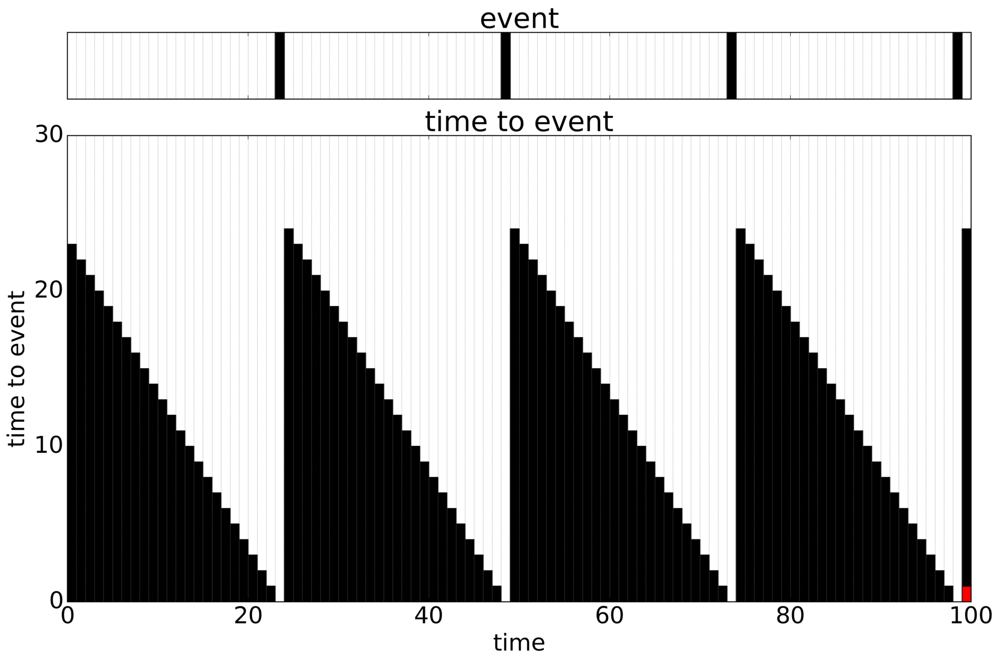
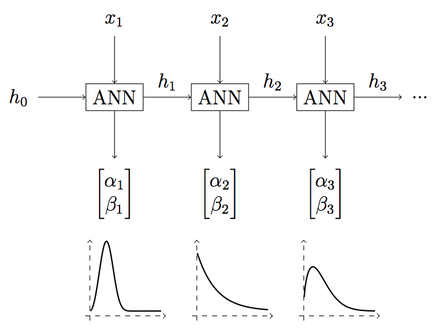

# WTTE-RNN

[](https://travis-ci.org/ragulpr/wtte-rnn)

베이불 시간-이벤트 순환 신경망 (Weibull Time To Event Recurrent Neural Network)

이벤트 발생 및 시간 예측에 대한 덜 어려운 기계 학습 프레임워크입니다.

서버 모니터링부터 지진 발생 및 생산량 예측 등의 다양한 문제는 크게 보면 이벤트가 발생하는 시간을 예측하는 문제입니다.
WTTE-RNN은 이러한 문제가 어떻게 다루어져야 하는가에 대한 알고리즘입니다.


* [블로그 글(영어)](https://ragulpr.github.io/2016/12/22/WTTE-RNN-Hackless-churn-modeling/)
* [석사 논문](https://ragulpr.github.io/assets/draft_master_thesis_martinsson_egil_wtte_rnn_2016.pdf)
* [모델](https://imgur.com/a/HX4KQ) 에 대한 빠른 시각적 소개
* Jupyter notebook: [간단](examples/keras/simple_example.ipynb), [모든 과정 포함](examples/data_pipeline/data_pipeline.ipynb )


# 설치

## Python

[파이썬 패키지를 위한 README](python/README.md)를 확인하세요.

필요없는 내용이 너무 많다고 생각하신다면, 기본적인 구현은 [jupyter notebook](examples/keras/standalone_simple_example.ipynb) 의 각 줄에서 확인하실 수 있습니다.

# 아이디어 및 기본 개념

많은 이벤트로 구성된 시계열 데이터를 갖고 있고, 과거의 데이터를 이용하여 다음 이벤트가 발생하는 시간 (TTE, time to the next event)을 예측하고 싶다고 가정해 봅시다. 아직 마지막 이벤트를 관측하지 않았다면 우리는 훈련 할 수 있는 TTE의 최소 경계선까지만 알고 있는 것입니다. 이것을 중도절단된 데이터 (*censored data*)라고 합니다. (빨간색으로 표시했습니다):



일종의 트릭으로, TTE 자체를 예측하는 대신 기계 학습 모델이 *확률 분포의 매개 변수* 를 출력하도록 해 봅시다. 어떤 확률 분포도 가능합니다만, 그 [굉장함](https://ragulpr.github.io/2016/12/22/WTTE-RNN-Hackless-churn-modeling/#embrace-the-Weibull-euphoria) 을 좋아해서 *Weibull 분포* 를 사용했습니다. 기계 학습 알고리즘 또한 그래디언트 기반의 임의의 알고리즘이 될 수 있습니다만, 우리가 그 [굉장함](http://karpathy.github.io/2015/05/21/rnn-effectiveness/)을 좋아해서 RNN을 선택했습니다.




다음 단계는 중도절단된 데이터에도 적용할 수 있는 특수한 log-loss 알고리즘을 선택해 훈련시키는 것입니다. 그 배경이 되는 직관은, *다음* 에 발생할 이벤트 시점에 높은 확률을 할당하거나, (중도절단된 데이터의 경우) 이벤트가 발생하지 *않을* 시점에 낮은 확률을 할당하고 싶다는 것입니다.


그 결과로 우리는 각 단계에서 *TTE의 분포* 에 대한 꽤 깔끔한 예측을 얻습니다 (아래는 단일 이벤트에 대한 것입니다):


다른 재미있는 결과는, 예측된 매개 변수들이 이벤트 *얼마나 빨리* (알파, alpha) 일어나고, *얼마나 확실하게* (베타, beta) 일어날 지에 대한 예측을 시각화하고 그룹화하는 데 사용할 수 있는 2차원 임베딩이라는 것입니다. 예측한 알파 (왼쪽)와 베타 (오른쪽)의 시간축을 쌓으면 다음과 같습니다.


## 주의할 점

특정 상황에서 아래의 멋진 손실 함수를 사용해도 되는 여러 수학 이론들이 있습니다.


따라서 중도 절단 된 데이터의 경우 절단된 시점을 넘은 시점에 대해서는 분포를 상향하는 쪽으로만 보상합니다. 제대로 된 결과를 얻으려면 특징(feature) 데이터에 절단 메커니즘에 의한 결과가 반영되지 않고 완전히 독립적이어야 합니다. 특징(feature)이 절단 시점을 포함한 정보를 담고 있다면, 알고리즘은 TTE 대신 절단 확률에 기반하여 예측하는 식으로 훈련될 것입니다. 이 경우 오버피팅/아티팩트 학습이 일어납니다. 전역 특징(global feature)은 잘 다루지 않으면 이런 효과를 나타낼 수 있습니다.

# 상태 및 로드맵

이 프로젝트는 개발중인 프로젝트입니다. 쉽게 포크하고 설치할 수 있는 모델 프레임워크를 목표로 하고 있습니다. WTTE-RNN은 알고리즘이고, churn_watch는 생산 모니터링 및 보고가 어떻게 아름답고 쉽게 이루어질 수 있는지에 대한 독창적인 아이디어로 구현중인 배포판입니다. pull-request, 추천, 의견 및 기고를 매우 환영합니다.

# 저장소 내용

* 변환기
    * 데이터 파이프라인 변환들 (pandas `DataFrame` of expected format to numpy)
    * 시간-이벤트 및 절단점 계산들
* Weibull 함수들(cdf,pdf,quantile,mean 등)
* 프레임워크 용으로 작성된 목적함수들
    * tensorflow
    * keras
* 신경층
    * Keras로 구현한 Weibull 출력층


## 멀티 프레임워크 지원

핵심 기술은 목적함수들입니다. 우린 이 목적함수들을 다양한 기계학습 프레임워크용으로 재사용할 수 있게 만드는 것을 목표로 하고 있습니다.

  * TensorFlow ✔
  * Keras (TensorFlow wrapper) ✔
  * MXnet
  * Theano
  * Torch
  * h2o
  * scikitFlow
  * MLlib

## 모델 입력 및 출력

모델을 사용하기 위해서는 원시 데이터를 tte용으로 변환해야 합니다. 모델 훈련을 위해서는 최종 출력을 위해 Weibull 함수들이 필요합니다.

  * SQL, R, Python으로 작성된 도움 함수들.

## 모니터링

WTTE-RNN은 기계학습 알고리즘인 동시에 데이터의 형태, 속성 및 예측에 대해 논의할 수 있는 시각 언어이기도 합니다.

  * 플롯 (일부가 마무리됨)
  * 멋짓 웹앱 또는 그 비슷한 것 (다른 곳에서 일부 마무리)
  * 알림기능 (e.g.,Slack/e-mail 봇 & 요약)
  * API

# 라이선스

  * MIT license

## Citation

```
@MastersThesis{martinsson:Thesis:2016,
    author = {Egil Martinsson},
    title  = {{WTTE-RNN : Weibull Time To Event Recurrent Neural Network}},
    school = {Chalmers University Of Technology},
    year   = {2016},
}
```

## 기여

질문은 egil.martinsson[at]gmail.com 으로 보내주세요.
가능하면 다른 사람들도 도울 수 있도록 이슈를 열어주세요.
기여/PR/댓글 및 기타 등등 모두 환영합니다!
